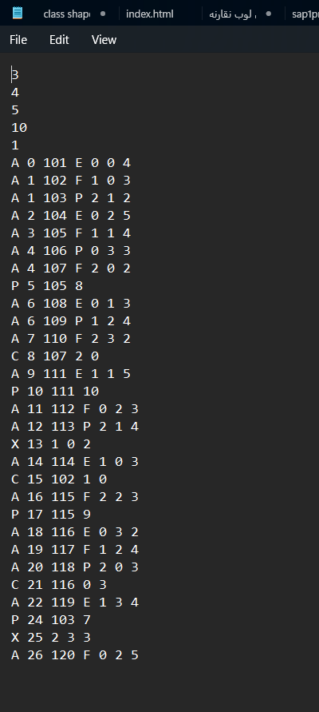
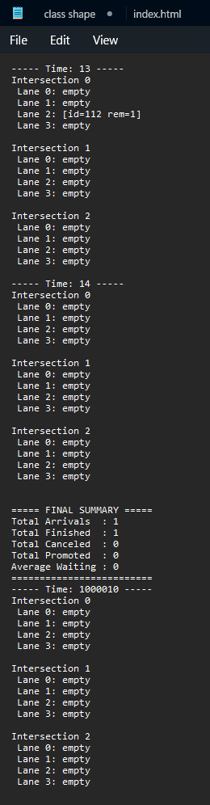

# Smart Traffic Management System

A traffic management simulator developed for the **CSAI 201** course using **C++**, **Object-Oriented Programming**, and custom-built **Data Structures**.

The system simulates traffic flow across multiple interconnected intersections while handling different vehicle types, traffic events, and traffic light scheduling.

---

## Features

- Traffic simulation across **4 interconnected intersections**
- Supports **30+ simulated vehicles**
- Four vehicle categories:
  - Electric Vehicles (EV)
  - Public Transport (PT)
  - Normal Cars (NC)
  - Freight Vehicles (FV)
- Handles traffic events:
  - Arrival (A)
  - Exit (X)
  - Priority (P)
  - Accident (ACC)
  - Road Closure (RC)
- Traffic light scheduling
- File-based simulation
- Final traffic summary generation

---

## Data Structures

Custom implementations of:

- Linked List
- Queue
- Priority Queue

---

## Technologies

- C++
- Object-Oriented Programming (OOP)
- Data Structures
- Visual Studio

---

## Project Structure

```text
main.cpp
TrafficControlCenter
Intersection
TrafficLight
Vehicle
Event
Queue
LinkedList
PriorityQueue
InputParser
UI
```

---

## Input

The simulator reads simulation data from a text file including:

- Vehicle information
- Intersections
- Events
- Traffic configuration

---
## Simulation Input

The simulator reads all simulation data from a structured text file containing vehicle information, traffic events, intersections, and simulation configuration.




## Output

The simulator generates:

- Detailed simulation log
- Vehicle movement updates
- Event processing
- Final simulation summary

---

## Sample Output

During execution, the simulator prints the state of each intersection over time and generates a final traffic summary including simulation statistics.



## Team Members

- Zeyad Mahmoud Elshayeb
- Retaj Reda
- Fatma Reda

---

## How to Run

### Requirements

- Visual Studio 2022 (or later)
- C++ Desktop Development workload

### Steps

1. Clone the repository.
2. Open the solution (.sln) file.
3. Build the project.
4. Make sure `sample_input.txt` is located in the project directory.
5. Run the application.


## Course

CSAI 201 – Data Structures
